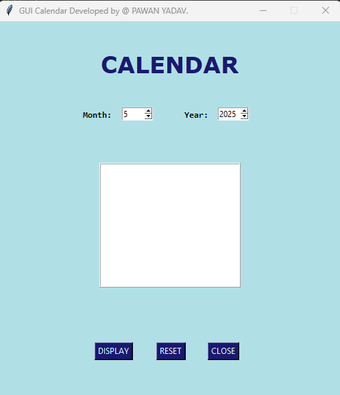

# 📅 GUI Calendar

A simple and user-friendly **Python GUI Calendar** application built using **Tkinter**. This app allows users to view monthly calendars by selecting the desired month and year. It also includes functionality to reset the calendar or close the application.

---

## 🛠 Features

- 📆 View calendar of any month/year
- 🔁 Reset to current month/year
- ❌ Close the application
- 🎨 Modern UI with clear text and layout

---

## 🚀 How to Run

1. **Clone this repository** or download the Python file.(https://github.com/2000pawan/Calendar-.git)

2. Make sure you have **Python 3.x** installed.

3. Run the script:

   ```bash
   python Calendar.py
   
## 📸 Screenshot




## 🧰 Requirements

tkinter (comes with Python)

PIL (Python Imaging Library, for optional image support)

calendar

datetime


## 📂 File Structure

calendar.py   # Main Python file

README.md         # Project documentation

## 👨‍💻 Author

PAWAN YADAV

GUI Calendar developed by @ PAWAN YADAV

## 📃 License

This project is licensed under the MIT License.

